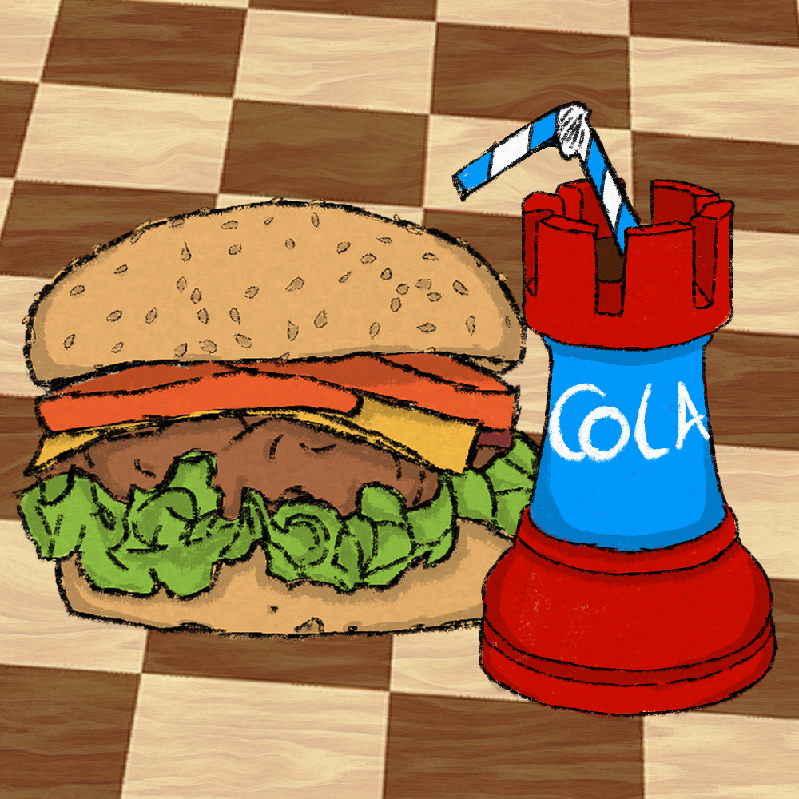
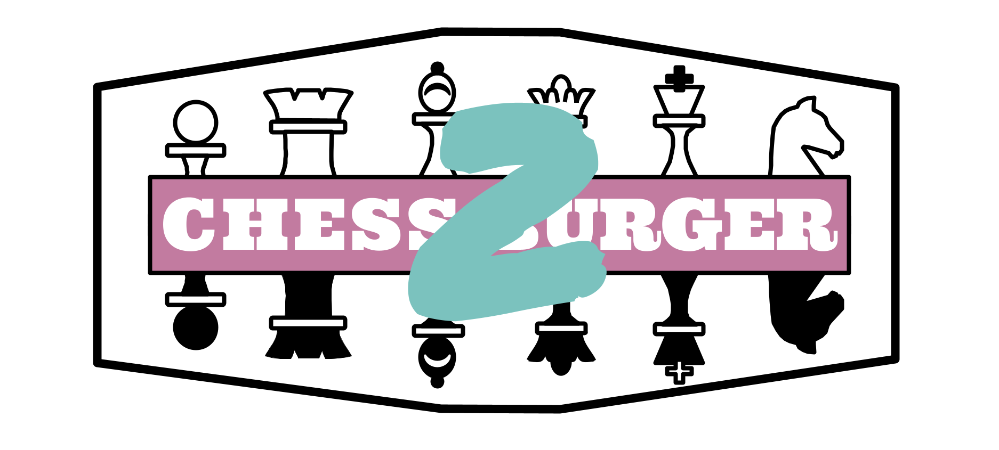

# CHESSBURGER __2__

## Presentation
As part of our computer training, we had the challenge of creating an Android application in Java. This application has to offer a service to a certain number of online users. This includes account and profile management and user interaction.

To realize this project, we wanted to take up a [previously developed project](https://github.com/virgil-rouquettecampredon/PROJET-TERL3), still within the framework of our studies, a modular chess set. We therefore took this code base in Java, to adapt it to the framework of this new project.

<b>Supervisor :</b>     
-  Abdelhak Seriai (abdelhak.seriai@umontpellier.fr) 

<b>Developers :</b>
- Ange Clément (ange.clement@etu.umontpellier.fr) 
- Erwan Reinders (erwan.reinders@etu.umontpellier.fr)
- Virgil Rouquette--Campredon (virgil.rouquette--campredon@etu.umontpellier.fr) 

## Production
- All the visuals used, except for the logo.
- The application in Java.
- The server part (FireBase).
- A WEB client.

## Build and Launch : 
You need to copy the files from `copyToBuild` to the build folder.

## Special mentions
We would like to thank Hugo Bec for his participation in the elaboration of the previous project, and Theo Bargacchi for the realization of our logo.

